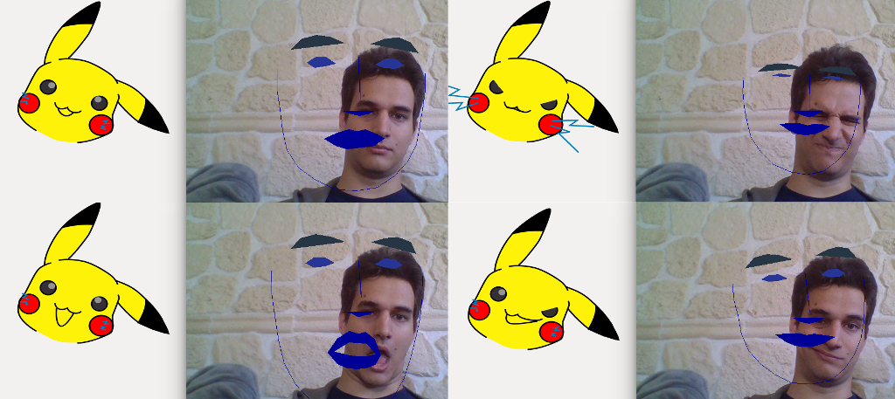

# Motion Capture & Blend Shaping

This code animates any SVG avatar.

You must provide some SVG files, being your avatar in different "key poses".
Then, using your webcam, you'll be able to generate all the poses in between
your key poses (that is, deforming the avatar smoothly to go from one to the
others).

Understanding that the program will procedurally "slide" from one key pose to
another, those constraints on the SVG files naturally appear:

* They all must have the same objects. It doesn't make sense to slide from
  nothing to something.
* For now, only paths are animated, and they all need to have the same
  drawing instructions, consistently absolute or relative. Interpolation
  between key pose is done super simply and just consist of a linear
  interpolation between the numbers in paths data.

